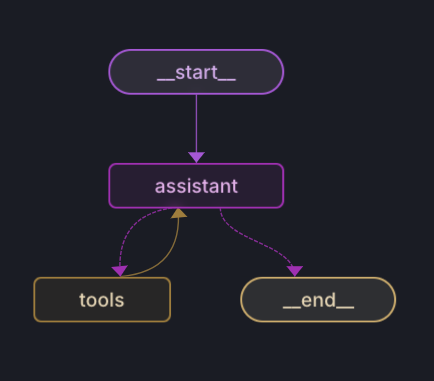
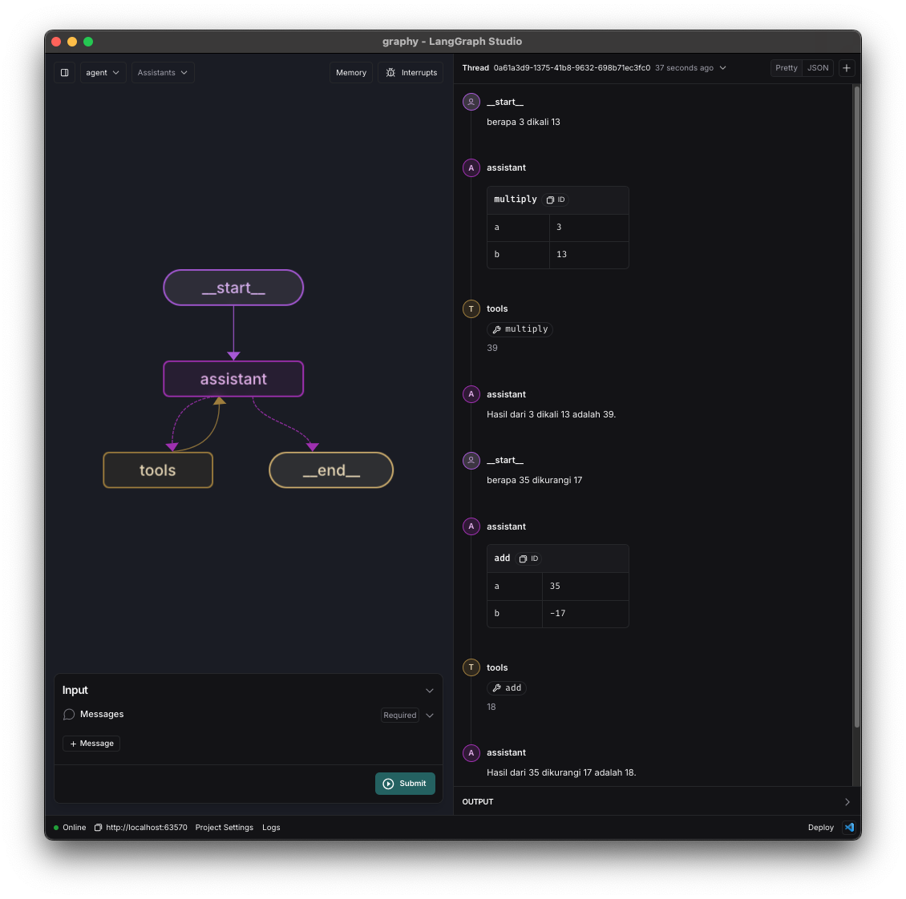

# Agent

Pada langgraph, agent merupakan sebuah objek yang bertugas untuk mengatur alur navigasi flow dengan menggunakan LLM dan tools.

## Perbedaan dengan Router

Pada router, hanya mengatur alur navigasi flow saja. Sedangkan pada agent, selain mengatur alur navigasi flow, juga mengatur alur navigasi flow dengan menggunakan LLM dan tools.

Agent juga akan menjadi penjawab dari pertanyaan yang diberikan oleh user.

## Penggunaan

di langgraph, bentuk dari kode diatas sebagai berikut:

## Komponen

### assistant

Komponen ini berfungsi untuk men-sanitize input dari user yang berupa text menjadi parameter yang dipanggil oleh tools.

Contohnya sebagai berikut:

> berapa 3 ditambah 5

Maka akan diubah oleh llm menjadi sebuah tabel mapping parameter

| Parameter | Value |
|-----------|-------|
| a         | 3     |
| b         | 5     |

### tools

Tools sendiri merupakan function yang akan dipanggil untuk men-solve permasalahan yang diberikan oleh user.

Apabila tidak ada tool yang cocok, maka akan diarahkan ke END dengan reason tidak ada tool yang cocok.

## Screenshot

 
