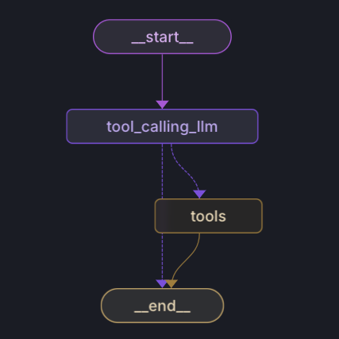
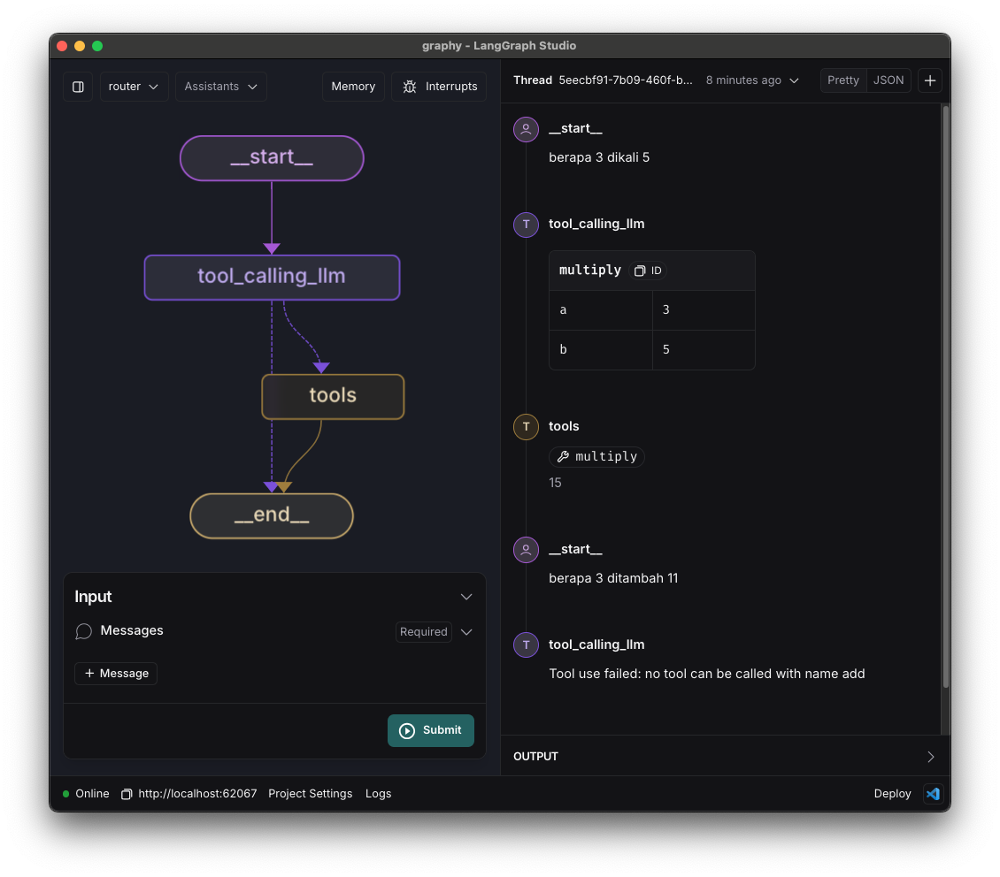

# Router

Pada langgraph, router merupakan sebuah objek yang bertugas untuk mengatur alur navigasi flow.

## Penggunaan

```python
builder = StateGraph(MessagesState)
builder.add_node("tool_calling_llm", tool_calling_llm)
builder.add_node("tools", ToolNode([multiply]))
builder.add_edge(START, "tool_calling_llm")
builder.add_conditional_edges("tool_calling_llm", tools_condition)
builder.add_edge("tools", END)
```

di langgraph, bentuk dari kode diatas sebagai berikut:



## Komponen

### tool_calling_llm

Komponen ini berfungsi untuk men-sanitize input dari user yang berupa text menjadi parameter yang dipanggil oleh tools.

Contohnya sebagai berikut:

> berapa 3 dikali 5

Maka akan diubah oleh llm menjadi sebuah tabel mapping parameter

| Parameter | Value |
|-----------|-------|
| a         | 3     |
| b         | 5     |

### tools

Tools sendiri merupakan function yang akan dipanggil untuk men-solve permasalahan yang diberikan oleh user.

Apabila tidak ada tool yang cocok, maka akan diarahkan ke END dengan reason tidak ada tool yang cocok.

## Screenshot

